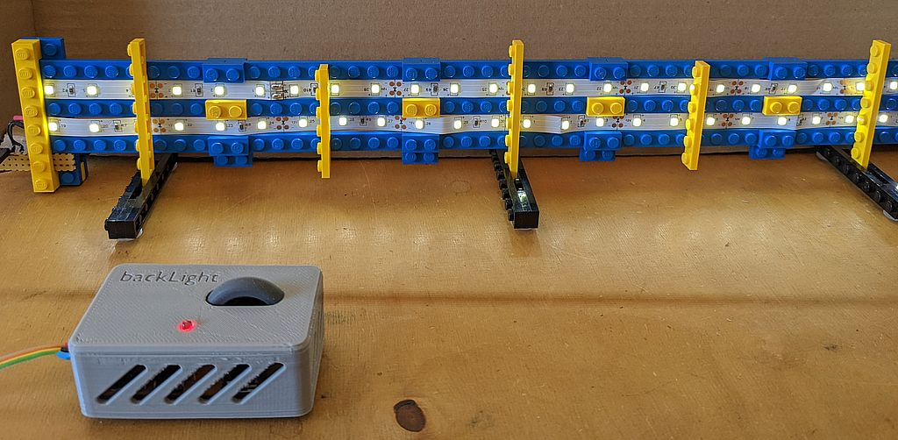
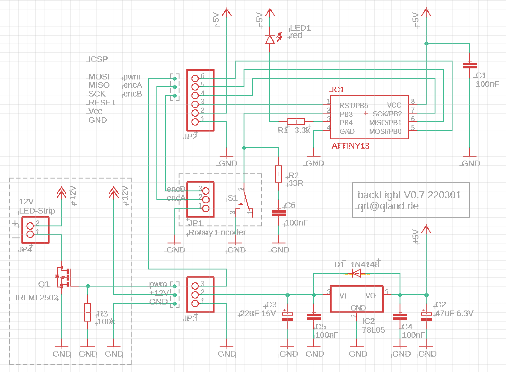
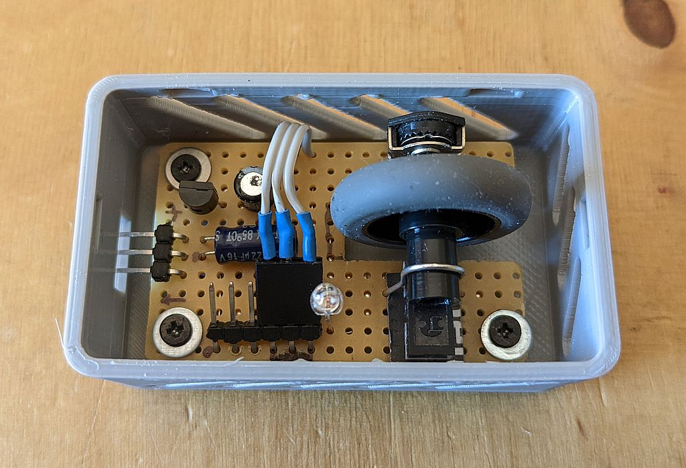
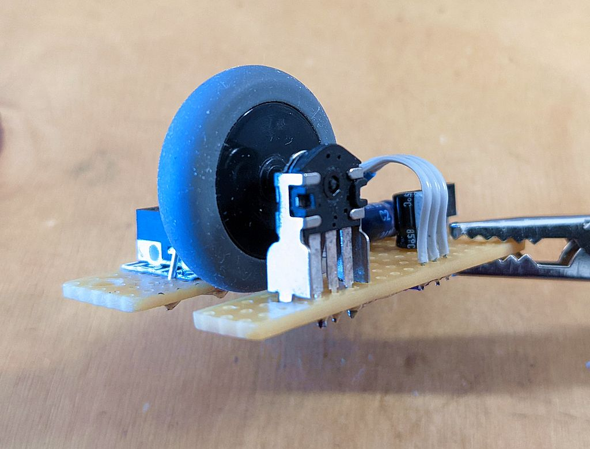
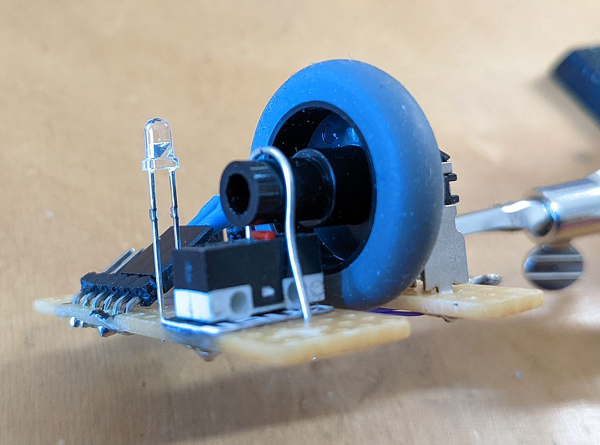
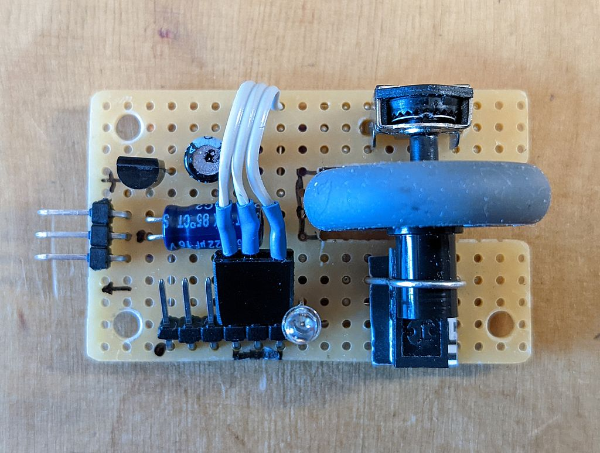
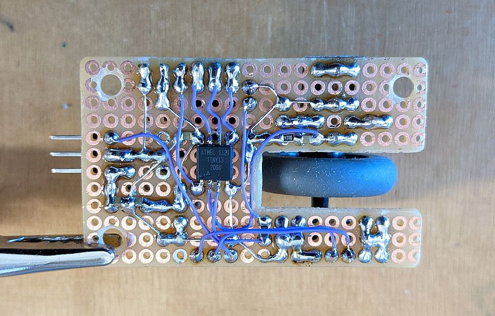

# **backLight**

### Brightness Control with Rotary Encoder for LED-Strip

<br>



<br>

## Summary
A mechanical rotary encoder allows smooth dimming of a LED-Strip, pressing the wheel switches between off-mid-max brightness. The raster of the encoder gives a nice haptic feeling when rolling the wheel. Encoder, wheel and switch originate from a mouse. The assembler source contains robust encoder routines to compensate switch bouncing.

<br>


## Links
[-> views](#views)  
[-> source](source)

<br>


## Options
Two options in source

```
.define PWLOGIC     1                   ;PWM logic          0 negative  1 positive
.define ENCDIR      0                   ;encoder direction  0 normal    1 reverse 

```

## Schematic


<br>


---

<br>

## Views

Inside the box  

<br>
<br>

Rotary encoder and mouse wheel  

<br>
<br>

Switch and mouse wheel  

<br>
<br>

Top view PCB  

<br>
<br>

Bottom View PCB  

<br>
<br>

<br>
<br>

---

[qrt@qland.de](mailto:qrt@qland.de) 220301
